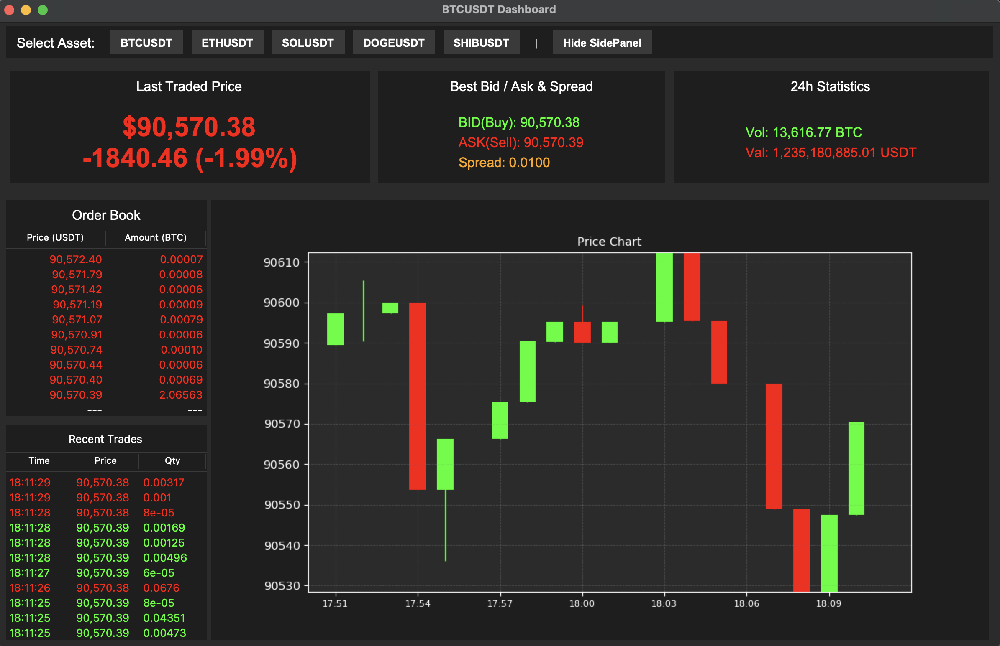
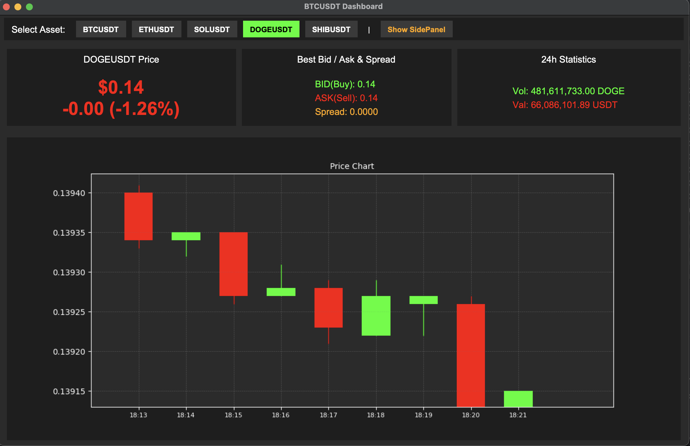
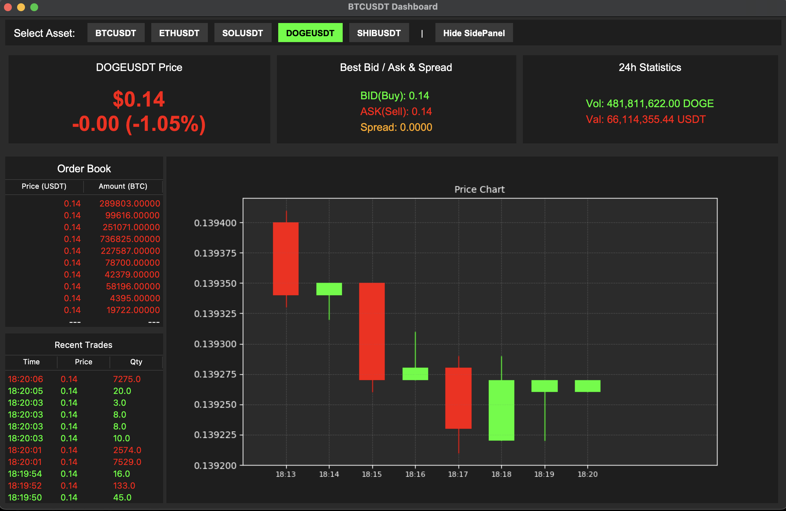

# Real-Time Cryptocurrency Dashboard 

A desktop dashboard for tracking cryptocurrency market data in real-time using Python, Tkinter, and Binance WebSocket API.

## Dashboard Preview
### 1. Full Dashboard View


### 2. SidePanel Hidden (Chart Focus)


### 3. Multi-Asset Support


## Features
* *Real-Time Data:* Live streaming prices, 24h statistics, and volume via Binance WebSocket.
* *Multi-Asset Support:* Track 5+ cryptocurrencies (BTC, ETH, SOL, DOGE, SHIB).
* *Interactive Charts:* Live 1-minute Candlestick chart built with Matplotlib.
* *Deep Market Data:* Real-time Order Book (Depth 10) and Recent Trades feed.
* *Smart UI:* Dark mode design with color-coded indicators (Green/Red) for price movements.
* *Customizable:* Toggle buttons to hide/show panels and persistent settings (remembers your last view).

## Technologies Used
* *Language:* Python 3.x
* *GUI:* Tkinter
* *Networking:* websocket-client, requests
* *Data Visualization:* Matplotlib
* *Data Handling:* JSON, Threading

## Installation & Usage

1.  *Clone the repository*
    
    git clone (https://github.com/Kongbeng-21/Final-Project-Cryptocurrency-Dashboard-with-Tkinter.git)
    cd crypto_dashboard
    

2.  *Install dependencies*
    
    pip install -r requirements.txt
    

3.  *Run the application*
    
    python main.py
    

## Project Structure
```text
crypto_dashboard/
│
├── main.py                  # Application Entry Point: Initializes the main window and threads.
├── requirements.txt         # Dependencies: List of required Python libraries.
├── README.md                # Documentation: Project overview and setup guide.
├── ui_design.png            # Screenshot: Final UI design reference.
├── user_prefs.json          # Settings: Stores user preferences (e.g., last selected coin).
├── .gitignore               # Git Ignore: Specifies files to be ignored by Git (e.g., venv).
│
├── components/              # UI Components (Frontend Modules)
│   ├── __init__.py          #  Package initialization.
│   ├── ticker.py            #  Displays Real-time Price, Stats, and Bid/Ask panels.
│   ├── orderbook.py         #  Displays the live Order Book (Bids & Asks).
│   ├── trades.py            #  Displays the Recent Trades feed.
│   └── chart.py             #  Renders the live Candlestick Chart using Matplotlib.
│
└── utils/                   # Utilities (Backend Logic)
    ├── __init__.py          #  Package initialization.
    ├── binance_api.py       #  Manages WebSocket connections and data streaming.
    └── config.py            #  Global configurations (Colors, Fonts, API URLs).
